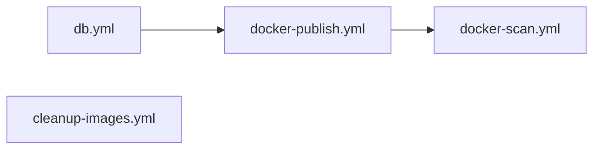

# GitHub Actions Workflows

This directory contains automated workflows for building, testing, and deploying the awesome-app.

## Workflows

### 1. `db.yml` - Build Awesome Database

**Triggers:**
- Schedule: Every 6 hours
- Manual: `workflow_dispatch` with options:
  - `build_mode`: `download` (default) or `build`
  - `awesome_repo`: Source repository (default: `valknarness/awesome`)
- Push to main (when db.yml or build-db.js changes)

**Purpose:**
Builds the SQLite database using one of two methods:

1. **Download Mode** (default, fast ~5 min):
   - Downloads pre-built database from the awesome CLI repository
   - Uses GitHub Actions artifacts from the upstream repo
   - Fallback to local build if download fails

2. **Build Mode** (slow ~1-2 hours):
   - Clones the awesome CLI repository
   - Runs full indexing using `./awesome index`
   - Scrapes all awesome lists from GitHub

**Dependencies:**
- Requires awesome CLI repository (checked out during workflow)
- GitHub CLI for artifact downloads
- better-sqlite3 for database operations

**Artifacts:**
- `awesome.db` - SQLite database file
- `db-metadata.json` - Metadata including:
  - Build mode used (download/build)
  - Source repository
  - Timestamp, hash, counts
  - Statistics (lists, repos, READMEs)

**Retention:** 90 days

---

### 2. `docker-publish.yml` - Build and Push Docker Image

**Triggers:**
- Push to `main` or `develop` branches
- Git tags matching `v*.*.*`
- Pull requests to `main`
- Manual: `workflow_dispatch`

**Dependencies:**
- Calls `db.yml` workflow first
- Downloads database artifact before building Docker image

**Features:**
- Multi-platform builds (linux/amd64, linux/arm64)
- Automatic semantic versioning from git tags
- GitHub Container Registry (ghcr.io)
- Build cache optimization
- Database metadata embedded in image labels
- Configurable database inclusion via `INCLUDE_DATABASE` build arg (default: `true` in CI)

**Image Tags:**
- `latest` - Latest build from main branch
- `main` - Latest main branch build
- `develop` - Latest develop branch build
- `v1.2.3` - Semantic version tags
- `main-abc1234` - Branch + commit SHA

**Image Labels:**
- Standard OCI labels (title, description, vendor, source)
- Database metadata (timestamp, hash, counts)

---

### 3. `docker-scan.yml` - Security Scanning

**Triggers:**
- Schedule: Daily at 2 AM UTC
- Push to `main` branch
- Git tags matching `v*.*.*`
- Manual: `workflow_dispatch`

**Purpose:**
Scans Docker images for security vulnerabilities using Trivy.

**Features:**
- SARIF report upload to GitHub Security tab
- Scans for CRITICAL, HIGH, and MEDIUM severity issues
- Automated daily security checks

---

### 4. `cleanup-images.yml` - Cleanup Old Docker Images

**Triggers:**
- Schedule: Weekly on Sundays at 3 AM UTC
- Manual: `workflow_dispatch` (configurable retention count)

**Purpose:**
Removes old untagged Docker images to save storage.

**Configuration:**
- Default: Keep 10 most recent versions
- Configurable via workflow_dispatch input

---

## Workflow Integration

The workflows are designed to work together:



1. **Database Build** (`db.yml`) runs every 6 hours and on-demand
2. **Docker Build** (`docker-publish.yml`) depends on database build
3. **Security Scan** (`docker-scan.yml`) runs after image push
4. **Cleanup** (`cleanup-images.yml`) runs weekly to free storage

## Usage

### Manual Database Build

```bash
# Download pre-built database (fast, default)
gh workflow run db.yml

# Download from specific repository
gh workflow run db.yml -f awesome_repo=owner/awesome

# Build locally (slow but fresh)
gh workflow run db.yml -f build_mode=build

# Custom source and build mode
gh workflow run db.yml -f build_mode=build -f awesome_repo=owner/awesome
```

### Manual Docker Build

```bash
gh workflow run docker-publish.yml -f tag=custom-tag
```

### Manual Security Scan

```bash
gh workflow run docker-scan.yml
```

### Manual Cleanup

```bash
gh workflow run cleanup-images.yml -f keep_count=20
```

## Environment Variables

Required repository secrets:
- `GITHUB_TOKEN` - Automatically provided
- `WEBHOOK_URL` - (Optional) Webhook for database updates
- `WEBHOOK_SECRET` - (Optional) Secret for webhook authentication

## Docker Image

Pull the latest image:

```bash
docker pull ghcr.io/valknarness/awesome-app:latest
```

Run with embedded database (CI builds):

```bash
docker run -p 3000:3000 ghcr.io/valknarness/awesome-app:latest
```

Run with volume-mounted database (local builds):

```bash
docker run -p 3000:3000 -v $(pwd)/data:/app/data ghcr.io/valknarness/awesome-app:latest
```

### Build Arguments

Control database inclusion when building locally:

```bash
# Include database in image (like CI)
docker build --build-arg INCLUDE_DATABASE=true -t awesome-app .

# Exclude database (mount at runtime)
docker build --build-arg INCLUDE_DATABASE=false -t awesome-app .
```

Or with docker-compose:

```yaml
services:
  awesome-app:
    build:
      args:
        INCLUDE_DATABASE: true  # or false
```

## Best Practices

1. **Database builds** happen automatically every 6 hours
2. **Docker images** are built on every push to main/develop
3. **Security scans** run daily to catch new vulnerabilities
4. **Old images** are cleaned up weekly to save storage
5. **Database metadata** is embedded in Docker image labels for traceability
