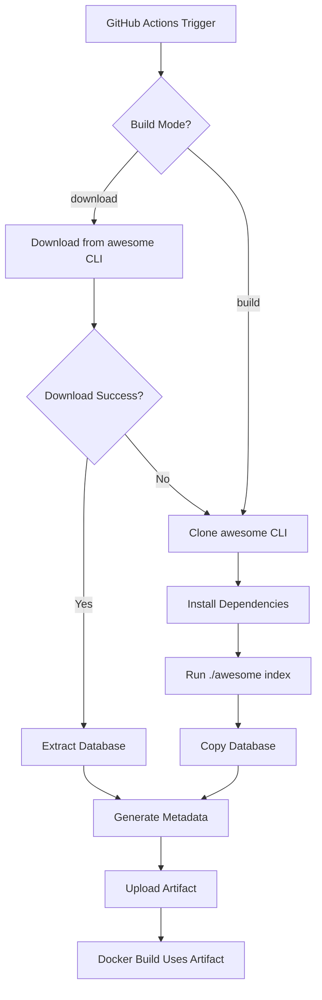

# Database Build System

This document explains how the awesome-app builds and maintains its SQLite database.

## Overview

The awesome-app uses a flexible database build system with two modes:

1. **Download Mode** (Fast): Downloads pre-built databases from the awesome CLI repository
2. **Build Mode** (Slow): Builds the database locally using the awesome CLI indexer

## Build Modes

### Download Mode (Default) ⚡

Downloads pre-built databases that are automatically created by the awesome CLI repository.

**Speed:** ~5 minutes
**Requirements:**
- GitHub CLI (`gh`)
- GitHub authentication
- Access to awesome CLI repository artifacts

**How it works:**
1. Fetches latest successful workflow run from awesome CLI repo
2. Downloads database artifact from GitHub Actions
3. Extracts and validates database
4. Falls back to build mode if download fails

**Advantages:**
- Very fast (5 min vs 1-2 hours)
- No GitHub API rate limits needed
- Consistent results
- Reduces infrastructure load

### Build Mode 🔨

Builds the database from scratch using the awesome CLI indexer.

**Speed:** ~1-2 hours
**Requirements:**
- awesome CLI repository (cloned during workflow)
- GitHub token for API access (5000 req/hour)
- Node.js 22+
- better-sqlite3

**How it works:**
1. Clones awesome CLI repository
2. Installs dependencies
3. Runs `./awesome index` with full mode
4. Copies resulting database

**Advantages:**
- Always fresh data
- No dependency on upstream artifacts
- Full control over indexing

## Scripts

### `scripts/build-db.js`

Main build script that handles both modes.

**Environment Variables:**
- `BUILD_MODE`: `download` or `build` (default: `download`)
- `AWESOME_REPO`: Repository to download from (default: `valknarness/awesome`)
- `GITHUB_TOKEN`: GitHub token for API access

**Usage:**
```bash
# Download mode (default)
node scripts/build-db.js

# Build mode
BUILD_MODE=build node scripts/build-db.js

# Custom repository
AWESOME_REPO=owner/repo node scripts/build-db.js

# Build mode with custom repo
BUILD_MODE=build AWESOME_REPO=owner/repo node scripts/build-db.js
```

**Output:**
- `awesome.db` - SQLite database file
- `db-metadata.json` - Build metadata

**Metadata Format:**
```json
{
  "version": "abc123...",
  "timestamp": "2025-10-26T13:45:00.000Z",
  "size": "156.42MB",
  "hash": "sha256...",
  "lists_count": 450,
  "repos_count": 15000,
  "readmes_count": 12500,
  "build_mode": "download",
  "source_repo": "valknarness/awesome"
}
```

## GitHub Actions Workflow

### `.github/workflows/db.yml`

**Triggers:**
- Schedule: Every 6 hours
- Manual: `workflow_dispatch` with parameters
- Push: Changes to db.yml or build-db.js

**Workflow Inputs:**
- `build_mode`: Choose download or build
- `awesome_repo`: Source repository

**Steps:**
1. Checkout awesome-app repository
2. Checkout awesome CLI repository
3. Install dependencies for both
4. Run build script
5. Verify database
6. Upload artifact
7. Create summary

**Artifacts:**
- Name: `awesome-database`
- Retention: 90 days
- Contents:
  - awesome.db
  - db-metadata.json

**Manual Triggering:**
```bash
# Download mode (fast)
gh workflow run db.yml

# Build mode (slow)
gh workflow run db.yml -f build_mode=build

# Custom repository
gh workflow run db.yml -f awesome_repo=owner/awesome

# Both options
gh workflow run db.yml -f build_mode=build -f awesome_repo=owner/awesome
```

## Integration with Docker

The docker-publish workflow automatically uses the database artifact:

```yaml
jobs:
  build-database:
    uses: ./.github/workflows/db.yml
    secrets: inherit

  build-and-push:
    needs: build-database
    # Downloads artifact and includes in Docker image
```

**Docker Build Args:**
- `INCLUDE_DATABASE`: `true` to embed database in image (default: `false`)

## Local Development

### Option 1: Download Database

```bash
# Install dependencies
pnpm install

# Build database (download mode)
node scripts/build-db.js

# Or with environment variables
BUILD_MODE=download AWESOME_REPO=valknarness/awesome node scripts/build-db.js
```

### Option 2: Build Database

```bash
# Clone awesome CLI (sibling directory)
cd ..
git clone https://github.com/valknarness/awesome.git
cd awesome-app

# Build database
BUILD_MODE=build node scripts/build-db.js
```

### Option 3: Download from GitHub Actions

```bash
# Find latest run
gh run list --workflow=db.yml --limit 1

# Download artifact
gh run download <run-id> -n awesome-database

# Move to project root
mv awesome-database/awesome.db .
mv awesome-database/db-metadata.json .
```

## Troubleshooting

### Download Mode Issues

**Problem:** No artifacts found
```bash
# Solution: Build locally instead
BUILD_MODE=build node scripts/build-db.js
```

**Problem:** GitHub CLI not authenticated
```bash
# Solution: Authenticate
gh auth login

# Or use token
export GITHUB_TOKEN=your_token_here
```

**Problem:** Download fails
```bash
# The script automatically falls back to build mode
# Check logs for fallback message
```

### Build Mode Issues

**Problem:** awesome CLI not found
```bash
# Solution: Clone to sibling directory
cd ..
git clone https://github.com/valknarness/awesome.git
cd awesome-app
```

**Problem:** API rate limits
```bash
# Solution: Set GitHub token
export GITHUB_TOKEN=your_token_here
```

**Problem:** Build timeout
```bash
# Solution: Increase timeout or use download mode
# Build mode takes 1-2 hours for full index
```

## Best Practices

### For CI/CD

1. **Use download mode** by default (fast, reliable)
2. **Set proper secrets** (GITHUB_TOKEN for downloads)
3. **Configure fallback** to build mode if download fails
4. **Monitor artifacts** retention (90 days)
5. **Track build time** to detect issues

### For Local Development

1. **Use download mode** for quick setup
2. **Use build mode** only when needed (testing indexer, custom data)
3. **Keep awesome CLI updated** (pull latest changes)
4. **Check metadata** to verify database freshness

### For Production

1. **Schedule regular builds** (every 6 hours recommended)
2. **Monitor build success** rate
3. **Verify database integrity** after builds
4. **Track metadata** for troubleshooting
5. **Implement alerts** for build failures

## Architecture



## Database Schema

The database is built by the awesome CLI and follows this schema:

**Tables:**
- `awesome_lists` - Hierarchical awesome lists
- `repositories` - Individual projects
- `readmes` - Full README content
- `readmes_fts` - Full-text search index
- `bookmarks` - User favorites (web app only)
- `custom_lists` - User lists (web app only)
- `reading_history` - Activity tracking (web app only)
- `tags` - Content tags
- `categories` - Content categories
- `settings` - Configuration

**Indexes:**
- FTS5 index for full-text search
- Foreign key indexes for relations
- Performance indexes on common queries

## Monitoring

### Key Metrics

- **Build time** (download: ~5 min, build: ~1-2 hours)
- **Database size** (~50-200 MB compressed)
- **Success rate** (target: >95%)
- **Artifact retention** (90 days)
- **Download vs build ratio** (target: 90% download, 10% build)

### Health Checks

```bash
# Check latest build
gh run list --workflow=db.yml --limit 1

# Download and verify
gh run download <run-id> -n awesome-database
sqlite3 awesome.db "SELECT COUNT(*) FROM repositories"

# Check metadata
cat db-metadata.json | jq .
```

## Future Improvements

1. **Incremental updates** - Only update changed READMEs
2. **CDN hosting** - Serve database from CDN for faster downloads
3. **Multiple regions** - Build and host in different regions
4. **Compression** - Better compression algorithms
5. **Checksums** - Verify database integrity
6. **Notifications** - Alert on build failures
7. **Metrics** - Track build performance over time
8. **Caching** - Cache intermediate results
